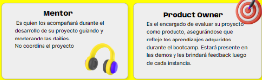
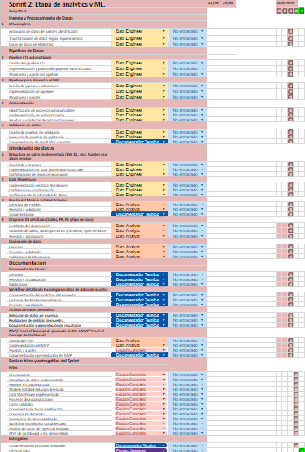
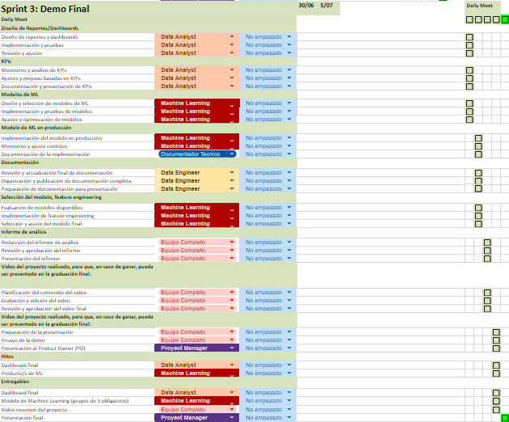

# Recursos y organizacion

### **Material brindado x Henry para completar el trabajo:**

1. **[KICK OFF PROYECTO FINAL SLIDES]([https://docs.google.com/presentation/d/17WLH3D5cgEbNA3XIKYKMEi20Q9pbo6kOXmD74nRhQaI/edit#slide=id.g1f3119b515c_0_509](https://docs.google.com/presentation/d/17WLH3D5cgEbNA3XIKYKMEi20Q9pbo6kOXmD74nRhQaI/edit#slide=id.g1f3119b515c_0_509))**
2. [GITHUB POROYECTO FINAL]([https://github.com/soyHenry/PF_DS/blob/FULL-TIME/README.md](https://github.com/soyHenry/PF_DS/blob/FULL-TIME/README.md))
3. **[PROYECTO 1  YELP &amp; GOOGLE MAPS - REVIEWS AND RECOMMENDATIONS]([https://github.com/soyHenry/PF_DS/blob/FULL-TIME/Proyectos/yelp-goople.md](https://github.com/soyHenry/PF_DS/blob/FULL-TIME/Proyectos/yelp-goople.md))**
   1. [Diccionario de datos](https://docs.google.com/document/d/1ASLMGAgrviicATaP1UJlflpmBCXtuSTHQGWdQMN6_2I/edit)
   2. [Dataset Google Maps](https://drive.google.com/drive/folders/1Wf7YkxA0aHI3GpoHc9Nh8_scf5BbD4DA?usp=share_link)
   3. [Dataset Yelp](https://drive.google.com/drive/folders/1TI-SsMnZsNP6t930olEEWbBQdo_yuIZF?usp=sharing)
4. [Hitos del proyecto]([https://docs.google.com/document/d/e/2PACX-1vRtTsN_N3Z0DTLbh_-Xw2OxhOWeV5jmTISRUNzTBpWM9mTnxsT03674UheR4f0hfULc2v4_sW3IgDTv/pub](https://docs.google.com/document/d/e/2PACX-1vRtTsN_N3Z0DTLbh_-Xw2OxhOWeV5jmTISRUNzTBpWM9mTnxsT03674UheR4f0hfULc2v4_sW3IgDTv/pub)) Documento donde se detallan las particularidades generales del proyecto que van a tener que realizar. Su lectura es de carácter obligatorio.
5. **✅Dailies: 12 reuniones. 80% de asistencia para aprobar. (10 asistencias obligatorias)**
6. **✅Demos: 3 reuniones. 100% de asistencia para aprobar.**
7. 
8. Prepárate para el comenzar 💯 Serán agregados a un canal de Slack de su grupo conjuntamente con su mentor. Organícense para comenzar las dailies con todo

---

#### 🏁 Sprint 1: Puesta en marcha del proyecto 🏁

* [ ] Lunes a Jueves Daily Meet
* [ ] **VIERNES DEMO 1: Se presenta lo trabajado en cada Sprint al Product Owner**

### [📅 Nuestro diagrama de Gantt](https://docs.google.com/spreadsheets/d/1SZAHRo0SPZk-DMIDneAckuduytsxMNGso4SlHRwaY8U/edit?usp=sharing) [📅 ](https://docs.google.com/spreadsheets/d/1SZAHRo0SPZk-DMIDneAckuduytsxMNGso4SlHRwaY8U/edit?usp=sharing)

---

#### 🏁 Sprint 2: Etapa de analytics y ML 🏁

* [ ] Lunes a Jueves Daily Meet
* [ ] **VIERNES DEMO 1: Se presenta lo trabajado en cada Sprint al Product Owner**

  

#### 🏁 Sprint 3: Demo Final 🏁

* [ ] Lunes a Jueves Daily Meet
* [ ] **VIERNES DEMO 1: Se presenta lo trabajado en cada Sprint al Product Owner**

---

### **2_ Video del Proyecto Final (3 min max)**

Realizar un video explicativo del trabajo que realizaron en esta última etapa.

La creación del video es obligatoria para todos los grupos (y si, van a poder subir esos videos a sus redes sociales y compartilos con quien lo deseen!)

Votación interna de la cohorte, los 3videos más votados, van a poder mostrarlos y presentar el día de la graduación.

**Requisitos del video:**

* Enviar el enlace del mismo al formulario que se les va a facilitar.
* Deadline: jueves 10:00 GMT-3 de la semana siguiente a la demo final.
* Ese mismo jueves haremos una votación abierta a toda la cohorte (desde 10:30 hasta 12:00 GMT-3) Y les comunicaremos los equipos ganadores
* Aclaración: se considerarán solamente los grupos aprobados para exponer.

 **Dejamos aquí unos videos de antiguas cohortes para inspiración**

- [Alpha Insights]([https://www.youtube.com/watch?v=KN-iIDbyfsk](https://www.youtube.com/watch?v=KN-iIDbyfsk)) , [NYC]([https://www.youtube.com/watch?v=yd0OdB8jBmo](https://www.youtube.com/watch?v=yd0OdB8jBmo)) , [Amazing Store]([https://www.youtube.com/watch?v=ZOg32CE-02E](https://www.youtube.com/watch?v=ZOg32CE-02E)), [MLGI]([https://www.youtube.com/watch?v=FwTQNhgZuj8](https://www.youtube.com/watch?v=FwTQNhgZuj8)), [Vocado]([https://www.youtube.com/watch?v=rMNKFNwfPkQ](https://www.youtube.com/watch?v=rMNKFNwfPkQ))

---

# EVALUACION

* [Rúbrica PO_Estudiantes](https://docs.google.com/document/d/1tBuh1LSCmvQB5Wd7-Cj4jj_o5zLk8vtBQFtDhF8oeSY/edit) : criterios que utilizarán los Product Owners para evaluar el desempeño del grupo demo a demo y proyectos.
* **✅Dailies: 12 reuniones. 80% de asistencia para aprobar. (10 asistencias obligatorias)**
* **✅Demos: 3 reuniones. 100% de asistencia para aprobar.**
  * De estas demos surgen las evaluaciones tanto del desempeño individual como el grupal, promediando notas de Mentor y PO.
* Serán evaluados de manera individual y grupal por su mentor: por ello es importante que asistan a las dailies e interactúen (tengan camara y microfono prendidos)
* El PO evaluará al grupo y al producto que genere el equipo. Los proyectos mejores calificados al finalizar el PF ( teniendo en cuenta el resultado grupal), serán los elegidos para presentar en la graduación de la cohorte frente a  empresas invitadas al evento
* Si el proyecto es desaprobado, todos los integrantes desaprobarán por consiguiente. Si el proyecto es aprobado, los integrantes dependen de sus notas individuales para aprobar
