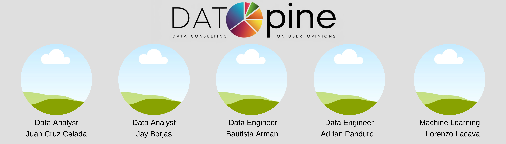

## Proyecto YELP & GOOGLE MAPS - REVIEWS AND RECOMMENDATIONS

Datopine, 

### INDICE DEL PROYECTO

- link
- link
- link
- link
- link
- link
- link
- link

## Objetivo y alcance del proyecto:

By bauto (**MEJORAR**):

La consultora Datapine, ha sido contratada para realizar un análisis del mercado de Pizzerias en Florida.

Nuestro cliente es x.

Nos proponemos:

* **Análisis de Sentimientos** :
  * 😊 Analizar las reseñas de Yelp y Google Maps para determinar el sentimiento general (positivo, negativo, neutral).
  * 🔍 Identificar tendencias y patrones en las opiniones de los usuarios.
* **Predicción de Crecimiento** :
  * 📈 Predecir cuáles rubros de negocios crecerán o decaerán.
  * 📉 Identificar áreas de oportunidad o riesgo.
* **Emplazamiento de Nuevos Locales** :
  * 🗺️ Determinar las mejores ubicaciones para abrir nuevos locales. basados en análisis de mercado y datos de reseñas.
* **Sistema de Recomendación** :
  * 🤖 Desarrollar un sistema que ofrezca recomendaciones personalizadas de restaurantes y otros negocios.
  * 🌟 Permitir a los usuarios descubrir nuevos sabores y experiencias basadas en sus reseñas previas.

## Descripción del conjunto de datos

By bauto (**MEJORAR**):

0 Diccionario_Datos.ipynb

- - 🌟 El conjunto de datos en este análisis incluye las reseñas que los usuarios dejan en Google Maps y Yelp sobre los establecimientos que visitan.
  - 📍 Además, contiene toda la metadata de estos lugares, como ubicación, horarios de apertura y cierre, y diversas características como infraestructura, servicios, ambiente, entre otros.

## Plan de trabajo

By bauto (**MEJORAR, breve explicacion de Scrum**):

- 📊 Utilizando la metodología Gantt, organizamos nuestro equipo para distribuir el trabajo de forma efectiva.
- Primero, creamos un diagrama de Gantt, donde asignamos a cada miembro del equipo para identificar a los responsables de cada tarea.
- ⏳ La longitud y posición de las barras en el diagrama muestran el período de tiempo dedicado a cada tarea.
- **FOTO GANT SPRINT 1**

## Stack Tecnológico

- FOTO GENERAL
- Descripcion
- .
- .
- .
- .

## 🏁 Sprint 1: Puesta en marcha del proyecto 🏁

Como se puede observar, el primer sprint se enfocó principalmente en iniciar el proyecto y realizar un análisis preliminar de los datos y las tecnologías a emplear.

 (CUANDO ESTE MEJOR EDITAR ESTA IMAGEN)

### 🏁 Sprint 2: Etapa de analytics y ML 🏁

En el segundo sprint, los roles serán cruciales y cada equipo tendrá tareas más específicas acorde a sus responsabilidades.

Sin embargo, como el objetivo principal de este sprint es finalizar la infraestructura del proyecto, el equipo de ingeniería de datos tendrá un rol prioritario, y los demás equipos deberán brindar apoyo en caso de ser necesario.

(CUANDO ESTE MEJOR EDITAR ESTA IMAGEN)

### 🏁 Sprint 3: Demo Final 🏁

En el tercer sprint, nuestro objetivo es tener listos los modelos de machine learning y el dashboard.

Nos enfocaremos en la narrativa del proyecto y en lograr una presentación que integre todo de manera completa, concisa y profesional.

(CUANDO ESTE MEJOR EDITAR ESTA IMAGEN)

## **Pipeline del proceso ETL**

- CARGA INCREMENTAL
- 0
- b
- c
- d
- e
- f
- g
- h

## Análisis de los datos

- 0
- b
- c
- d
- e
- f
- g
- h

## Tecnologias utilizadas

- 0
- b
- c
- d
- e
- f
- g
- h

## Índice de Archivos del Repositorio

.

## Equipo involucrado

- LINKS A LINKEDIN
