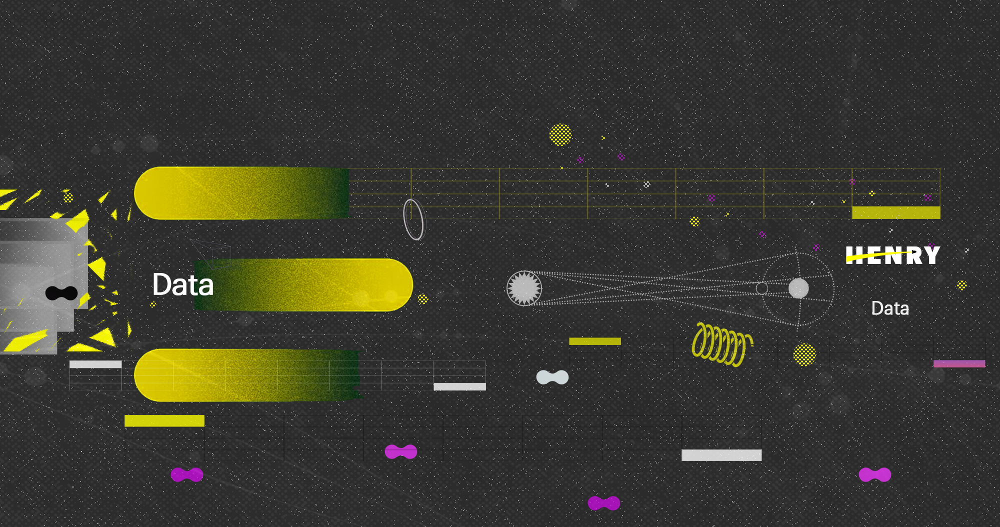

# Proyecto Grupal "YELP & GOOGLE MAPS - REVIEWS AND RECOMMENDATIONS

## **Descripción del proyecto**

## Objetivo general

## Descripción del conjunto de datos

## Plan de trabajo

Por medio de la metodologia X organizamos elequipo para repartir el trabajo de la siguiente manera:

📅🎨📈 Creamos un diagrama de Gantt donde se indica el responsable de cada tarea mediante el color de la barra.

Si una tarea está a cargo de más de una persona, el color de la barra será violeta. La longitud y la posición de la barra indican el período de tiempo asignado para esa tarea.

### Sprint 1

🚀📊💻 Como se puede observar, el primer sprint se enfocó principalmente en iniciar el proyecto y realizar un análisis preliminar de los datos y las tecnologías a emplear.

### Sprint 2

🚀🔧📊 En el segundo sprint, los roles serán cruciales y cada equipo tendrá tareas más específicas acorde a sus responsabilidades.

Sin embargo, como el objetivo principal de este sprint es finalizar la infraestructura del proyecto, el equipo de ingeniería de datos tendrá un rol prioritario, y los demás equipos deberán brindar apoyo en caso de ser necesario.

### Sprint 3

🌟📊📈 En el tercer sprint, nuestro objetivo es tener listos los modelos de machine learning y el dashboard.

Nos enfocaremos en la narrativa del proyecto y en lograr una presentación que integre todo de manera completa, concisa y profesional.

## **Pipeline**

## Análisis de los datos

## Tecnologias utilizadas

## Equipo involucrado
